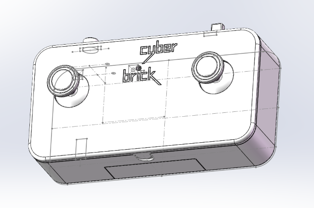
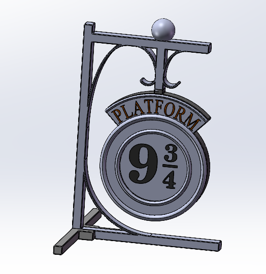
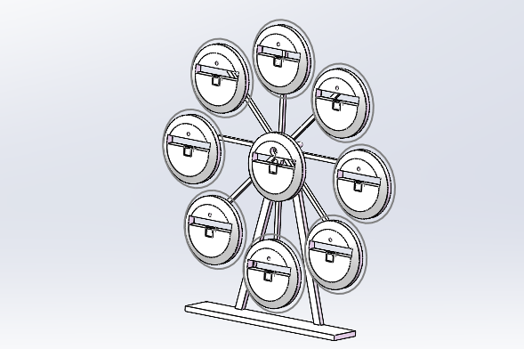
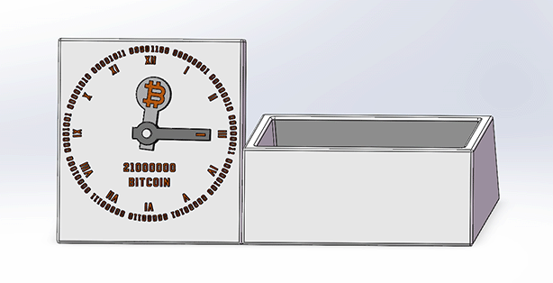
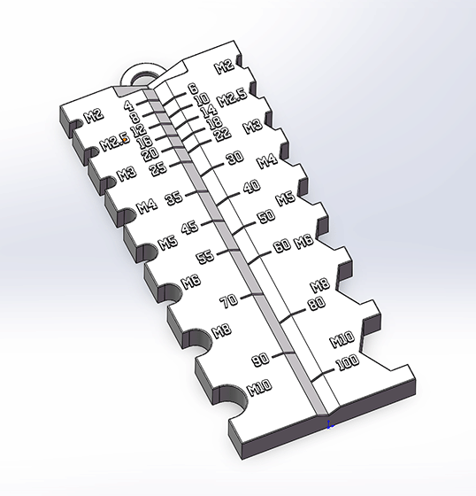
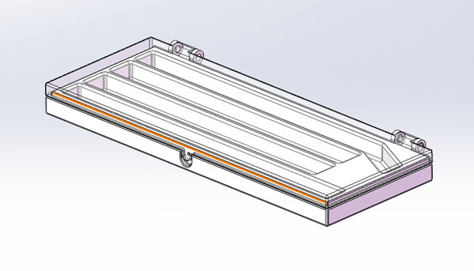

# 3D打印模型 | [3D Printable Models](#english)

可直接3D打印的模型，包括：

## CyberBrick遥控器

与官方遥控器布局兼容的锂电池版本，增加LED指示灯。

- [MakerWorld打印](https://makerworld.com.cn/models/1599181-cyberbrick-remote-li-battery-version)
- [SolidWorks模型](cyberbrick-remote/source)
- [3MF格式](cyberbrick-remote/cyberbrick-remote.3MF)
- [STEP格式](cyberbrick-remote/step)

## 9¾站台灯

哈利波特著名的9¾站台灯。

- [MakerWorld打印](https://makerworld.com.cn/models/1686416-93-4-light)
- [SolidWorks模型](9-4-3-light/source)
- [3MF格式](9-4-3-light/9-4-3-light.3MF)
- [STEP格式](9-4-3-light/step)

## 吧唧摩天轮

用于展示58mm吧唧的摩天轮，一共可以展示9个吧唧。

- [MakerWorld打印](https://makerworld.com.cn/models/1659285-ba-ji-mo-tian-lun-badge-ferris-wheel)
- [SolidWorks模型](badge-ferris-wheel/source)
- [3MF格式](badge-ferris-wheel/badge-ferris-wheel.3MF)
- [STEP格式](badge-ferris-wheel/step)

## 比特币时钟

一个带笔筒的桌面比特币时钟，使用一节5号电池。

- [MakerWorld打印](https://makerworld.com.cn/models/1555117-bitcoin-clock)
- [SolidWorks模型](bitcoin-clock/source)
- [3MF格式](bitcoin-clock/bitcoin-clock.3MF)
- [STEP格式](bitcoin-clock/step)

## 螺丝测量器

可快速测量国标M2、M2.5、M3、M4、M5、M6、M8、M10的螺栓和螺母。

- [MakerWorld打印](https://makerworld.com.cn/models/1555118-screw-measuring-tool-luo-si-ce-liang-gong-ju)
- [SolidWorks模型](screw-measuring-tool/source)
- [3MF格式](screw-measuring-tool/screw-measuring-tool.3MF)
- [STEP格式](screw-measuring-tool/step)

## 镊子收纳盒

可收纳4个镊子。

- [MakerWorld打印](https://makerworld.com.cn/zh/models/1595507-tweezers-storage-box)
- [SolidWorks模型](tweezers-storage-box/source)
- [3MF格式](tweezers-storage-box/tweezers-storage-box.3MF)
- [STEP格式](tweezers-storage-box/step)

# 3D Printable Models | [3D打印模型](#chs)

3D printable models:

## CyberBrick Remote

Remote with Li-Battery and LED, compatible with official remote.

- [MakerWorld Print](https://makerworld.com/models/1808814-cyberbrick-remote-li-battery-version)
- [SolidWorks Model](cyberbrick-remote/source)
- [3MF File](cyberbrick-remote/cyberbrick-remote.3MF)
- [STEP File](cyberbrick-remote/step)

## 9¾ Platform Light

Harry Potter 9¾ Platform Light.

- [MakerWorld Print](https://makerworld.com/models/1902427-93-4-light)
- [SolidWorks Model](9-4-3-light/source)
- [3MF File](9-4-3-light/9-4-3-light.3MF)
- [STEP File](9-4-3-light/step)

## 吧唧摩天轮

The Ferris wheel that is used to display 58mm badges, and can display a total of 9 badges.

- [MakerWorld Print](https://makerworld.com/models/1867225-badge-ferris-wheel)
- [SolidWorks Model](badge-ferris-wheel/source)
- [3MF File](badge-ferris-wheel/badge-ferris-wheel.3MF)
- [STEP File](badge-ferris-wheel/step)

## Bitcoin Clock

A desktop Bitcoin clock with a pen holder, powered by an AA battery.

- [MakerWorld Print](https://makerworld.com/models/885209-bitcoin-clock)
- [SolidWorks Model](bitcoin-clock/source)
- [3MF File](bitcoin-clock/bitcoin-clock.3MF)
- [STEP File](bitcoin-clock/step)

## Screw Measuring tool

A useful screw measuring tool for quickly measuring bolts and nuts with GB standard M2, M2.5, M3, M4, M5, M6, M8 and M10.

- [MakerWorld Print](https://makerworld.com/models/841870-screw-measuring-tool)
- [SolidWorks Model](screw-measuring-tool/source)
- [3MF File](screw-measuring-tool/screw-measuring-tool.3MF)
- [STEP File](screw-measuring-tool/step)

## Tweezers Storage Box

Can hold 4 tweezers.

- [MakerWorld Print](https://makerworld.com/models/1804980-tweezers-storage-box)
- [SolidWorks Model](tweezers-storage-box/source)
- [3MF File](tweezers-storage-box/tweezers-storage-box.3MF)
- [STEP File](tweezers-storage-box/step)
