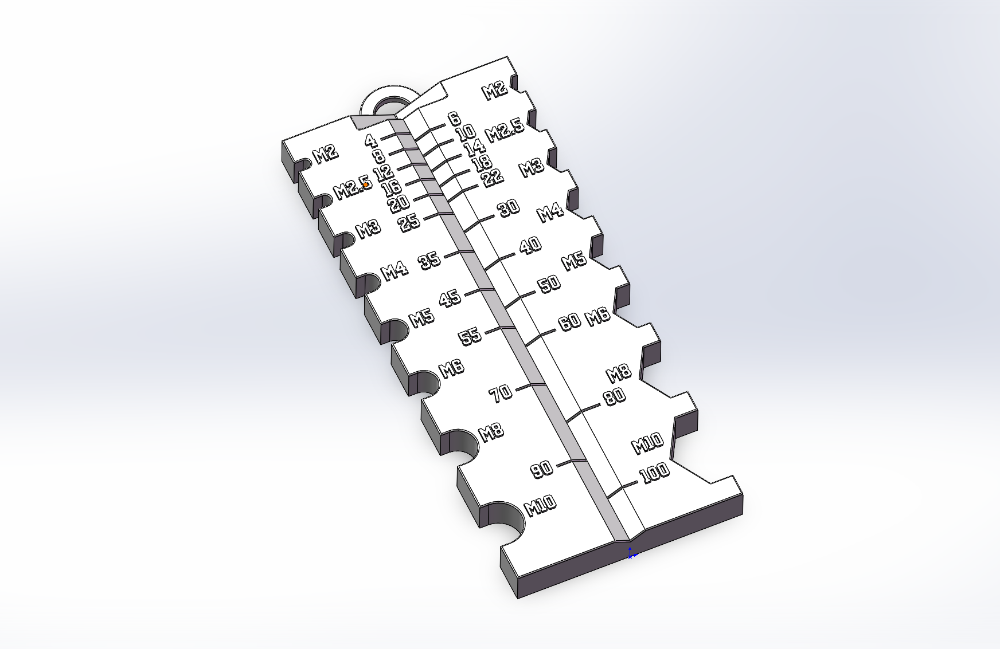

# 3D打印模型

可直接3D打印的模型，包括：

## 螺丝测量器

可快速测量国标M2、M2.5、M3、M4、M5、M6、M8、M10的螺栓和螺母。

- [SolidWorks模型](螺丝测量器/螺丝测量器.SLDPRT)
- [3MF格式](螺丝测量器/螺丝测量器.3MF)
- [STEP格式](螺丝测量器/螺丝测量器.STEP)
- [STL格式](螺丝测量器/螺丝测量器.STL)
